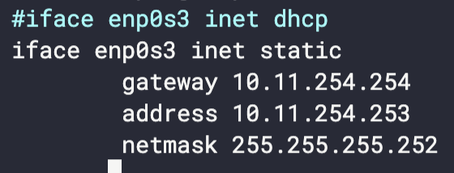

<h1 align="center">roger-skyline-1 </h1>

<h2><em>
Introduction to System and Network administration
</em></h2>

Warning: Information found from this repository is mostly my notes. This means that info might be really scattered and not that clear for other users!

<!-- > <h3 align="center">"System and Network administration"</h3> -->

<h2 align="center">
    <a href="#virtual-machine">Virtual Machine</a>
    ·
    <a href="#network-and-security">Network and Security</a>
    ·
    <a href="#web">Web</a>
</h2>

# Virtual Machine

## Disk partitions

> 1.  You have to run a Virtual Machine with the Linux OS of your choice in the hypervisor of your choice.
> 2.  Disk size has to be 8GB
> 3.  At least one 4.2 GB partition.

OS: Debian

Hypervisor: Virtual Box

Partitions for the Virtual Machine are easiest to do when you are installing VM for the first time. The partition can also be done afterward, but it can be a little bit cumbersome.

How to check partitions from the terminal:\
`lsblk`

## Packages

Updating packages

`apt-get update`\
`apt-get 	upgrade`

# Network and Security

## New user

> Create a non-root user to connect to the VM.

`useradd <name>`

> Give this user access rights to `sudo` commands.

Install sudo package:

`apt install sudo`

`sudo vim /etc/sudoers`

	<username>  ALL=(ALL) NOPASSWD:ALL

## Static IP

> Configure VM so it does NOT use DHCP.
> It also needs to use static IP and a Netmask \30

`apt install vim` (Because nobody does use nano.)

`sudo vim /etc/network/interfaces`

## Port

> Change the default port to one of your choice.\
> SSH access HAS TO be done with publickeys. SSH root access SHOULD NOT be allowed directly, but with a user who can be root.

`sudo vim /etc/ssh/sshd_config`

    Port 2021
    PubkeyAuthentication yes
    PasswordAuthentication no
    PermitRootLogin no

`sudo systemctl restart sshd`

> ["Please note that port numbers 0-1023 are reserved for various system services"](https://www.cyberciti.biz/faq/howto-change-ssh-port-on-linux-or-unix-server/)

## Firewall

> You have to set the rules of your firewall on your server only with the services used outside the VM.

`sudo apt install ufw`

`sudo ufw default deny incoming`

`sudo ufw default allow outgoing`

Enable ports for services that we need:

HTTP

`sudo ufw allow 80/tcp`

HTTPS

`sudo ufw allow 443`

SSH

`sudo ufw allow 2021/tcp`

Enable UFW on startup:

`sudo vim /etc/ufw/ufw.conf`

    ENABLED=yes
    sudo ufw enable
    sudo ufw verbose

## Denial of Service Attack

> You have to set a DOS (Denial Of Service Attack) protection on the open ports of your VM.

## fail2ban

Installing needed packages:

`sudo apt-get install iptables apache2 fail2ban`

Create a copy from `jail.conf` and rename it to `jail.local`, because jail.conf can be overwritten by an update.

`cp /etc/fail2ban/jail.conf /etc/fail2ban/jail.local`

Command for checking what IP:s has been updated:

`sudo fail2ban-client status <name of jail>`
| File Name | Description |
|-------------|-------------|
|`/etc/fail2ban/fail2ban.conf` |Main config file|
|`/etc/fail2ban/filter.d/http-get-dos.conf`| Filter file|

Resources for configurations:

[Fail2Ban Port 80 to protect sites from DOS Attacks](https://www.tothenew.com/blog/fail2ban-port-80-to-protect-sites-from-dos-attacks/)

[Install fail2ban to protect your site from DOS attacks](https://www.garron.me/en/go2linux/fail2ban-protect-web-server-http-dos-attack.html)

[How to unban an IP in fail2ban](https://linuxhint.com/unban-ip-fail2ban/)

## Prevent port scanning

> You have to set protection against scans on your VM’s open ports.

## PSAD

Resource:

[How to block port scan attacks with psad](https://www.unixmen.com/how-to-block-port-scan-attacks-with-psad-on-ubuntu-debian/)

The command for seeing all open ports:

`sudo lsof -i -P -n | grep LISTEN`

Commands:

| Command                                   | Description                |
| ----------------------------------------- | -------------------------- |
| `sudo psad -S`                            | Show PSAD status           |
| `sudo psad -F`                            | Unban everyone             |
| `sudo psad --fw-rm-block-ip <IP-Address>` | Allow particular addresses |

## Unnecessary services

> Stop the services you don’t need for this project.

Disable certain services:

`sudo systemctl disable <SERVICE_NAME>`

Show status of all services:

`sudo service--status-all`

## Scripts and Crontab

> Create a script that updates all the sources of the package, then your packages, and which logs the whole in a file named /var/log/update_script.log. Create a scheduled task for this script once a week at 4 AM and every time the machine reboots.

Resource:

[Scheduling cron tasks](https://linuxize.com/post/scheduling-cron-jobs-with-crontab/)

A command for setting systemwide cron tasks:

`sudo crontab -e`

    #!bin/bash
    #
    # Updates all source packages. Log saved to /var/log/update_script.log
    
    sudo echo "--------------------------" >> /var/log/update_script.log
    sudo echo "Date $(date)" >> /var/log/update_script.log
    sudo apt-get update -y >> /var/log/update_script.log
    sudo apt-get upgrade -y >> /var/log/update_script.log
    echo "--------------------------" >> /var/log/update_script.log

Different commands for Cron:

| Command                  | Description                                             |
| ------------------------ | ------------------------------------------------------- |
| `crontab -e`             | Edits crontab entries to add, delete, or edit cron jobs |
| `crontab -l`             | List all the cron jobs for the current user.            |
| `crontab -u username -e` | Edit another user's crons                               |

> Make a script to monitor changes of the /etc/crontab file and sends an email to the root if it has been modified. Create a scheduled script task every day at midnight.

Resources:

[Setting up local mail delivery on Ubuntu](https://www.cmsimike.com/blog/2011/10/30/setting-up-local-mail-delivery-on-ubuntu-with-postfix-and-mutt/)

[Most simple mail service](https://www.cyberciti.biz/faq/delete-all-root-email-mailbox/)

# Web

## Landing page

[How to Create a Simple Login Page Using HTML and CSS](https://www.c-sharpcorner.com/article/creating-a-simple-login-page-using-html-and-css/)

## SSL certificate

Resource:

[How To Create a Self-Signed SSL Certificate for Apache in Debian 10 | DigitalOcean](https://www.digitalocean.com/community/tutorials/how-to-create-a-self-signed-ssl-certificate-for-apache-in-debian-10)

# Resources and Tools

## Subnet calculator

[IP Subnet Calculator](https://www.calculator.net/ip-subnet-calculator.html?cclass=any&csubnet=20&cip=10.11.254.254&ctype=ipv4&printit=0&x=0&y=0)

## Crontab tool

[The cron schedule expression editor](https://crontab.guru/every-day-at-1am)
